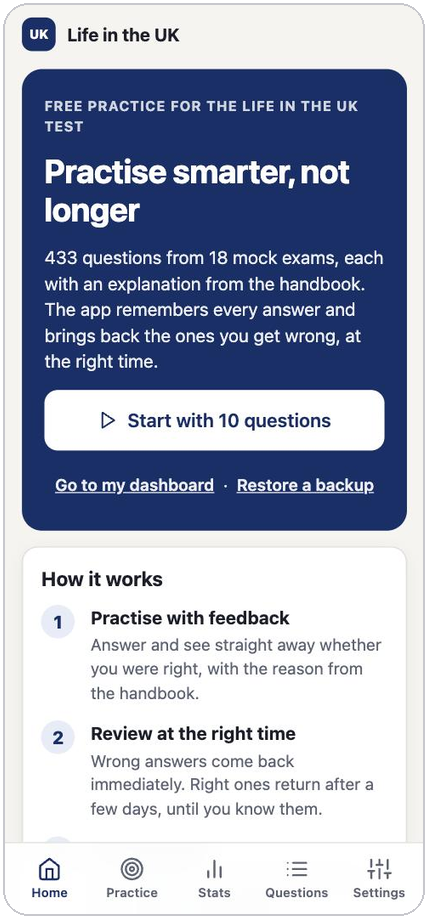
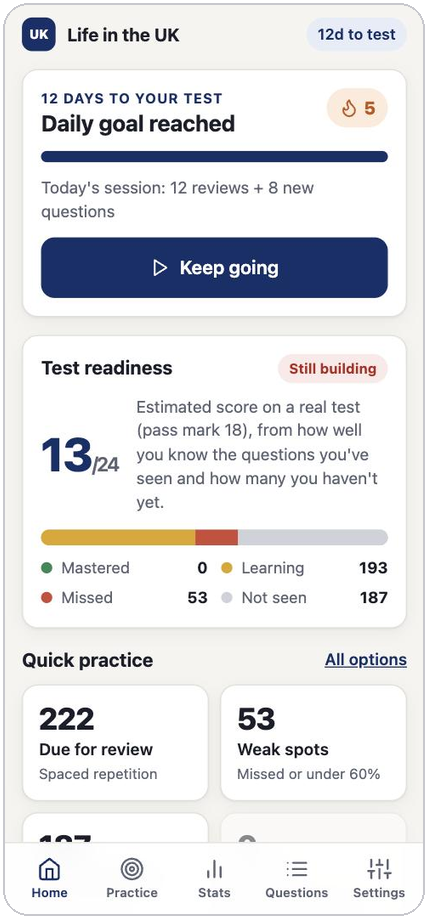
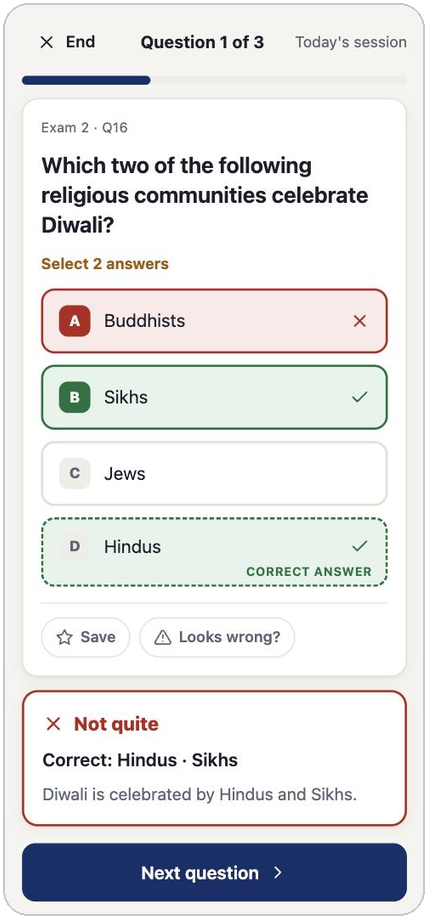
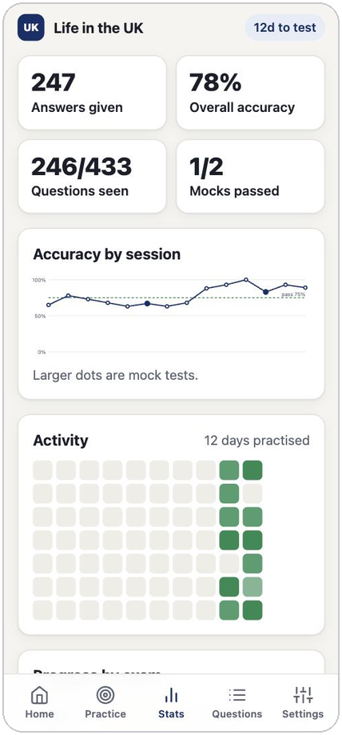

# Life in the UK Practice

**Free practice for the Life in the UK test that remembers what you've learnt and brings back what you got wrong.**

*No sign-up · works on phone, tablet and laptop · works offline · your progress stays on your device*

 

 &nbsp;  &nbsp;  &nbsp; 

Screenshots use demo progress.

## Why use it

- **It remembers.** Every answer is saved, so it always knows which questions you haven't seen, which you got right, and which you keep missing.
- **It decides what to practise.** One tap starts today's session: questions due for review first, then new ones. Right answers come back after a few days, wrong ones straight away. Enter your test date and reviews are scheduled to land before it.
- **It practises like the real thing.** Take a mock test with the real format: **24 questions, 45 minutes, pass mark 18/24 (75%)**, and no hints until you finish. "Choose two" questions work the way they do on the day.
- **It explains.** Every answer comes with an explanation from the handbook, so you learn the reason and not just the answer.
- **It shows your progress.** See your estimated score, accuracy over time, which of the 18 mock exams you've covered, and your weak spots.

## How to use it

1. **Open the link:** <https://ceo-0168.github.io/life-in-the-uk-practice/>. Safari, Chrome, Edge and Firefox all work, on any device.
2. **Tap "Start today's session"** and answer. Check each answer for instant feedback.
3. **Come back each day.** Home shows what's due, your streak, and how ready you are. When you feel ready, take a mock test.

**Optional: install it like an app.** It then opens full-screen from your home screen or Dock and works without internet.

| Device | How |
|---|---|
| iPhone / iPad | In **Safari**: Share → **Add to Home Screen** |
| Android / Chrome | Menu → **Install app** |
| Mac or Windows (Chrome, Edge) | Install icon in the address bar |
| Mac (Safari) | File → **Add to Dock** |

## The real test at a glance

The Life in the UK test is the computer-based multiple-choice test used for British citizenship and settlement applications. It has **24 questions**, takes **45 minutes**, and needs **18 correct (75%)** to pass. You book it through GOV.UK: <https://www.gov.uk/life-in-the-uk-test>. This app is a study aid and is not affiliated with the Home Office.

## Your progress and privacy

- **Everything is stored in your own browser.** There are no accounts, and the app doesn't send your answers anywhere.
- **Use the same browser each time.** Safari and Chrome keep separate copies, and so do your phone and laptop.
- **Move between devices** with **Settings → Download backup** on one and **Import & merge** on the other. Merging is safe to repeat. Live sync between devices is planned.
- **Back up now and then.** Clearing your browser's site data, or using a private or incognito window, deletes progress. A backup file makes sure you can't lose it.
- **On iPhone, install it first.** Safari can clear a website's data after about a week without a visit, but an installed app keeps it. The installed app starts empty, so import a backup into it once if you already practised in Safari.

## About the questions

The questions come from an **unofficial** community question bank, so they are not official Home Office questions. Every question has been checked against the *Life in the UK* handbook (3rd edition, with later updates), and no answer key contradicted it. Typos and unclear wording were fixed, and explanations were added where they were missing (almost all of Exam 18 had none).

Where the handbook and today's law differ (for example, the Senedd now has 96 members, and the jury age limit is now 75), the app marks the **handbook answer**, because that is what the test follows, and adds a note saying what has changed. If an answer still looks wrong to you, tap **Looks wrong?** on the question to flag it.

## Frequently asked questions

**Does it cost anything?** No.

**Does it work offline?** Yes, after your first visit.

**Will I lose my progress if I close the tab?** No. It's saved after every answer, and an unfinished mock test resumes where you left it.

**Can I use it on my phone and laptop?** Yes, but progress doesn't sync automatically yet. Use backup and merge to combine them.

**Can I pick which questions to practise?** Yes: questions due for review, weak spots, new questions, saved ones, or any of the 18 original mock exams. You can also search every question.

## For developers

See the [development guide](docs/DEVELOPMENT.md) for the architecture, how progress is protected, the data pipeline and how to deploy.

## Licence and credits

The application code is released under the [MIT licence](LICENSE). The question data and handbook wording are third-party content that the licence does not cover: see [NOTICE.md](NOTICE.md).

Questions originate from [DHKLeung/life-in-the-uk-test](https://github.com/DHKLeung/life-in-the-uk-test). Explanations draw on the *Life in the United Kingdom: A Guide for New Residents* handbook (Crown copyright).
