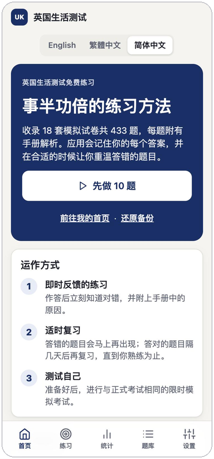
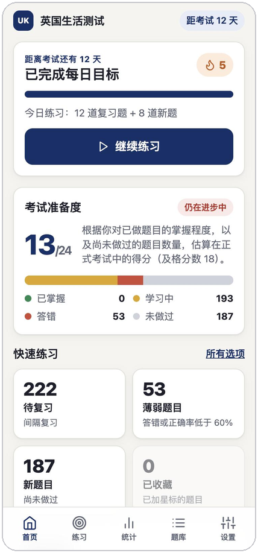
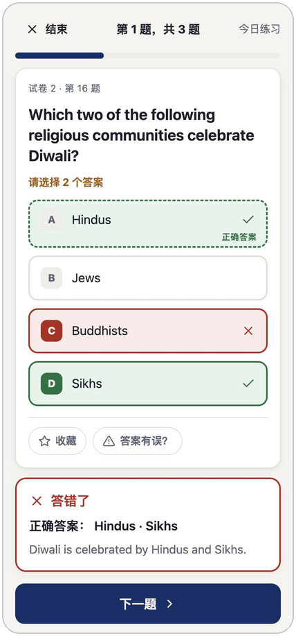
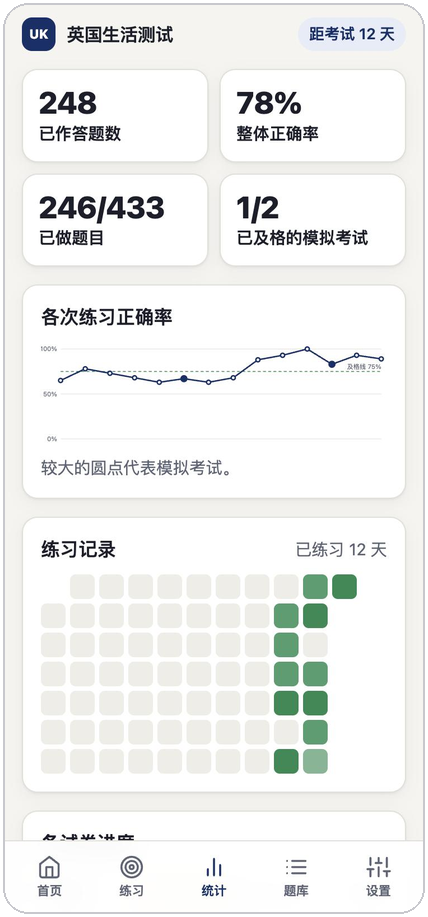

# 英国生活测试练习

**免费的“Life in the UK”测试练习工具：记住你学过的内容，并把答错的题目带回来。**

*无需注册 · 手机、平板、电脑均可使用 · 可离线使用 · 进度只保存在你的设备上*

[English](README.md) · [繁體中文](README.zh-Hant.md) · [简体中文](README.zh-Hans.md)

 

 &nbsp;  &nbsp;  &nbsp; 

截图使用演示数据。

> **语言说明：** 应用的菜单、按钮和说明文字提供**简体中文**和**繁體中文**。**题目、选项和解析保持英文**，与正式考试一致，因为正式考试只提供英文（以及威尔士语和苏格兰盖尔语）。

## 为什么使用

- **它会记住你。** 每个答案都会保存，所以它知道哪些题目你没做过、哪些答对了、哪些一直答错。
- **它安排你该练习什么。** 一键开始今日练习：先复习到期的题目，再做新题。答对的题目隔几天后再出现，答错的题目马上再出现。填写考试日期后，系统会安排复习在考试前完成。
- **它模拟真实考试。** 进行与正式考试相同格式的模拟考试：**24 题、45 分钟、答对 18 题（75%）及格**，作答期间没有提示。“选择两个答案”的题目也和正式考试一样。
- **它会解析。** 每个答案都附有手册中的解析，让你明白原因，而不只是记住答案。
- **它显示你的进度。** 查看估算得分、正确率走势、18 套模拟试卷的完成情况，以及你的薄弱题目。

## 如何使用

1. **打开链接：** <https://ceo-0168.github.io/life-in-the-uk-practice/>。Safari、Chrome、Edge 和 Firefox 都可使用，任何设备均可。
2. 在页面上选择**简体中文**（或自动检测），然后点按**“先做 10 题”**。作答后立即查看对错和解析。
3. **每天回来练习。** 首页会显示待复习的题目、连续练习天数和准备程度。准备好后，进行模拟考试。

**可选：像应用一样安装。** 之后可从主屏幕或程序坞全屏打开，并可在没有网络时使用。

| 设备 | 方法 |
|---|---|
| iPhone / iPad | 在 **Safari** 中：分享 →“**添加到主屏幕**” |
| Android / Chrome | 菜单 →“**安装应用**” |
| Mac 或 Windows（Chrome、Edge） | 地址栏中的安装图标 |
| Mac（Safari） | 文件 →“**添加到程序坞**” |

## 正式考试一览

“Life in the UK”测试是英国申请入籍和定居时使用的电脑选择题考试。共 **24 题**，时间 **45 分钟**，需答对 **18 题（75%）** 才及格。你可通过 GOV.UK 预约：<https://www.gov.uk/life-in-the-uk-test>。本应用只是学习辅助工具，与英国内政部无关。

## 你的进度与隐私

- **所有数据都保存在你自己的浏览器中。** 没有账户，应用也不会把你的答案发送到任何地方。
- **每次请使用同一个浏览器。** Safari 和 Chrome 各有独立的记录，手机和电脑也一样。
- **在设备之间转移进度：** 在一台设备上选择**“设置”→“下载备份”**，在另一台上选择**“导入并合并”**。合并可重复进行，不会出错。自动同步功能正在规划中。
- **请定期备份。** 清除浏览器的网站数据，或使用隐私／无痕窗口，会删除进度。备份文件可确保你不会丢失。
- **在 iPhone 上，请先安装。** Safari 可能在约一周没有访问后清除网站数据，但已安装的应用会保留数据。已安装的应用一开始是空的，如果你之前已在 Safari 中练习，请导入一次备份。

## 关于题目

题目来自一个**非官方**的社区题库，并非英国内政部的官方题目。每道题都已对照《Life in the UK》官方手册（第 3 版及其后更新）核对，没有发现与手册相矛盾的答案。过程中也修正了错别字和含糊的措辞，并补上缺少的解析（第 18 套试卷几乎全部没有解析）。

如果手册与现行法律不同（例如现在威尔士议会 Senedd 有 96 名议员，陪审员年龄上限现为 75 岁），应用会标示**手册的答案**，因为正式考试以手册为准，并附上说明已有什么变化。如果你仍觉得某个答案有误，请在该题点按**“答案有误？”**反馈。

## 常见问题

**要收费吗？** 不用。完全免费、无广告。如果它帮到你，欢迎[请我喝杯咖啡](https://buymeacoffee.com/ryanchan)。

**可以离线使用吗？** 可以，首次访问后便可离线使用。

**关闭标签页会丢失进度吗？** 不会。每次作答后都会保存，未完成的模拟考试也可以从中断处继续。

**手机和电脑可以同时使用吗？** 可以，但进度暂时不会自动同步。请使用备份和合并功能把两边结合。

**可以自己选择练习哪些题目吗？** 可以：待复习的题目、薄弱题目、新题、已收藏的题目，或 18 套原有模拟试卷中的任何一套。你也可以搜索所有题目。

## 开发者

架构、进度保护机制、数据流程和部署方式，请参阅[开发指南](docs/DEVELOPMENT.md)（英文）。

## 许可与致谢

应用代码以 [MIT 许可](LICENSE)发布。题目数据和手册内容属第三方内容，不在该许可范围内，详见 [NOTICE.md](NOTICE.md)。

题目来源：[DHKLeung/life-in-the-uk-test](https://github.com/DHKLeung/life-in-the-uk-test)。解析参考《Life in the United Kingdom: A Guide for New Residents》手册（英国王室版权）。
