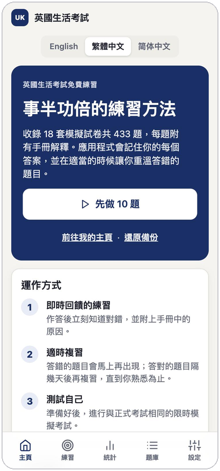
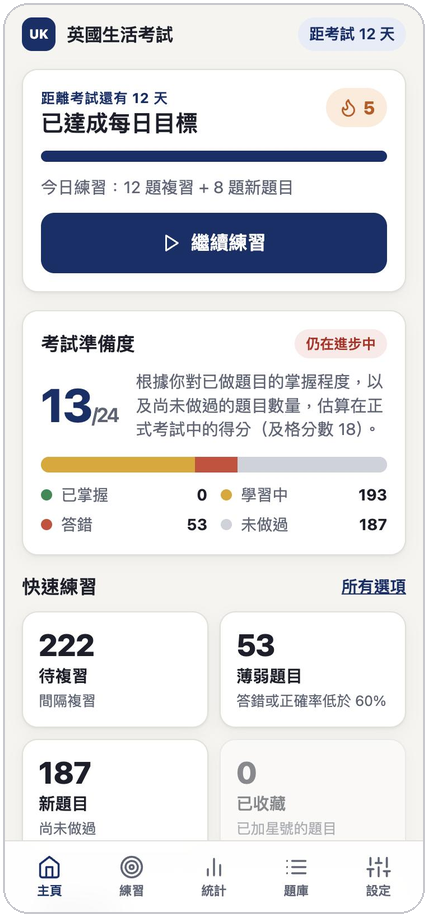
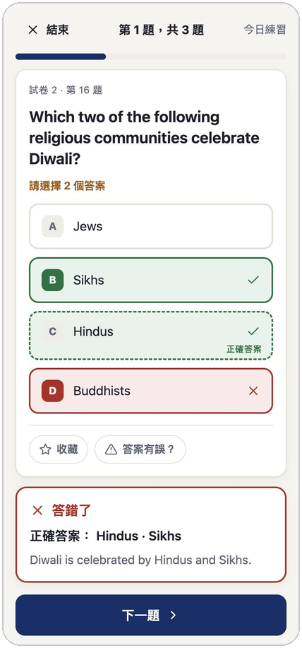
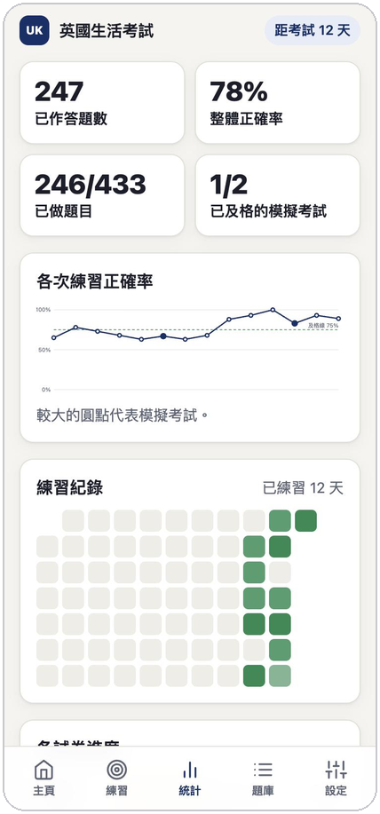

# 英國生活考試練習

**免費的「Life in the UK」考試練習工具：記住你學過的內容，並把答錯的題目帶回來。**

*無需註冊 · 手機、平板、電腦皆可使用 · 可離線使用 · 進度只儲存在你的裝置*

[English](README.md) · [繁體中文](README.zh-Hant.md) · [简体中文](README.zh-Hans.md)

 

 &nbsp;  &nbsp;  &nbsp; 

截圖使用示範資料。

> **語言說明：** 應用程式的選單、按鈕和說明文字提供**繁體中文**和**简体中文**。**題目、選項和解釋保持英文**，與正式考試一致，因為正式考試只提供英文（以及威爾斯語和蘇格蘭蓋爾語）。

## 為什麼使用

- **它會記住你。** 每個答案都會儲存，所以它知道哪些題目你沒做過、哪些答對了、哪些一直答錯。
- **它安排你該練習什麼。** 一鍵開始今日練習：先複習到期的題目，再做新題目。答對的題目隔幾天後再出現，答錯的題目馬上再出現。填寫考試日期後，系統會安排複習在考試前完成。
- **它模擬真實考試。** 進行與正式考試相同格式的模擬考試：**24 題、45 分鐘、答對 18 題（75%）及格**，作答期間沒有提示。「選擇兩個答案」的題目也和正式考試一樣。
- **它會解釋。** 每個答案都附有手冊中的解釋，讓你明白原因，而不只是記住答案。
- **它顯示你的進度。** 查看估算得分、正確率走勢、18 套模擬試卷的完成情況，以及你的薄弱題目。

## 如何使用

1. **打開連結：** <https://ceo-0168.github.io/life-in-the-uk-practice/>。Safari、Chrome、Edge 和 Firefox 都可使用，任何裝置皆可。
2. 在畫面上選擇**繁體中文**（或自動偵測），然後點按**「先做 10 題」**。作答後立即查看對錯和解釋。
3. **每天回來練習。** 主頁會顯示待複習的題目、連續練習日數和準備程度。準備好後，進行模擬考試。

**選用：像應用程式一樣安裝。** 之後可從主畫面或 Dock 全螢幕開啟，並可在沒有網絡時使用。

| 裝置 | 方法 |
|---|---|
| iPhone / iPad | 在 **Safari** 中：分享 →「**加入主畫面**」 |
| Android / Chrome | 選單 →「**安裝應用程式**」 |
| Mac 或 Windows（Chrome、Edge） | 網址列中的安裝圖示 |
| Mac（Safari） | 檔案 →「**加入 Dock**」 |

## 正式考試一覽

「Life in the UK」考試是英國申請入籍和定居時使用的電腦選擇題考試。共 **24 題**，時間 **45 分鐘**，需答對 **18 題（75%）** 才及格。你可透過 GOV.UK 預約：<https://www.gov.uk/life-in-the-uk-test>。本應用程式只是學習輔助工具，與英國內政部無關。

## 你的進度與私隱

- **所有資料都儲存在你自己的瀏覽器。** 沒有帳戶，應用程式也不會把你的答案傳送到任何地方。
- **每次請使用同一個瀏覽器。** Safari 和 Chrome 各有獨立的紀錄，手機和電腦也一樣。
- **在裝置之間轉移進度：** 在一部裝置選擇**「設定」→「下載備份」**，在另一部選擇**「匯入並合併」**。合併可重複進行，不會出錯。自動同步功能正在規劃中。
- **請定期備份。** 清除瀏覽器的網站資料，或使用私人／無痕視窗，會刪除進度。備份檔案可確保你不會遺失。
- **在 iPhone 上，請先安裝。** Safari 可能在約一星期沒有造訪後清除網站資料，但已安裝的應用程式會保留資料。已安裝的應用程式一開始是空的，如果你之前已在 Safari 練習，請匯入一次備份。

## 關於題目

題目來自一個**非官方**的社群題庫，並非英國內政部的官方題目。每道題都已對照《Life in the UK》官方手冊（第 3 版及其後更新）核對，沒有發現與手冊相矛盾的答案。過程中也修正了錯別字和含糊的措辭，並補上缺少的解釋（第 18 套試卷幾乎全部沒有解釋）。

如果手冊與現行法律不同（例如現在威爾斯議會 Senedd 有 96 名議員，陪審員年齡上限現為 75 歲），應用程式會標示**手冊的答案**，因為正式考試以手冊為準，並附上說明已有什麼變動。如果你仍覺得某個答案有誤，請在該題點按**「答案有誤？」**回報。

## 常見問題

**要收費嗎？** 不用。完全免費、無廣告。如果它幫到你，歡迎[請我喝杯咖啡](https://buymeacoffee.com/ryanchan)。

**可以離線使用嗎？** 可以，首次造訪後便可離線使用。

**關閉分頁會遺失進度嗎？** 不會。每次作答後都會儲存，未完成的模擬考試也可以從中斷處繼續。

**手機和電腦可以同時使用嗎？** 可以，但進度暫時不會自動同步。請使用備份和合併功能把兩邊結合。

**可以自己選擇練習哪些題目嗎？** 可以：待複習的題目、薄弱題目、新題目、已收藏的題目，或 18 套原有模擬試卷中的任何一套。你也可以搜尋所有題目。

## 開發者

架構、進度保護機制、資料流程和部署方式，請參閱[開發指南](docs/DEVELOPMENT.md)（英文）。

## 授權與致謝

應用程式程式碼以 [MIT 授權](LICENSE)發布。題目資料和手冊內容屬第三方內容，不在該授權範圍內，詳見 [NOTICE.md](NOTICE.md)。

題目來源：[DHKLeung/life-in-the-uk-test](https://github.com/DHKLeung/life-in-the-uk-test)。解釋參考《Life in the United Kingdom: A Guide for New Residents》手冊（英國皇室版權）。
